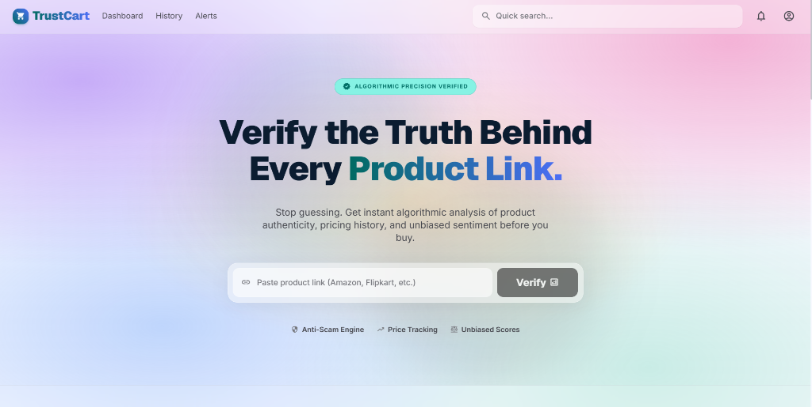
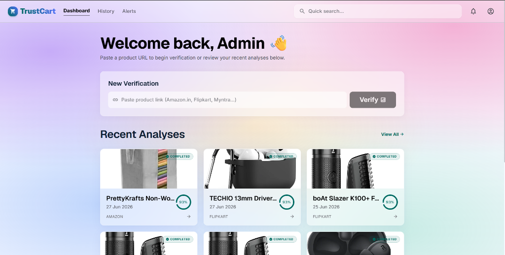
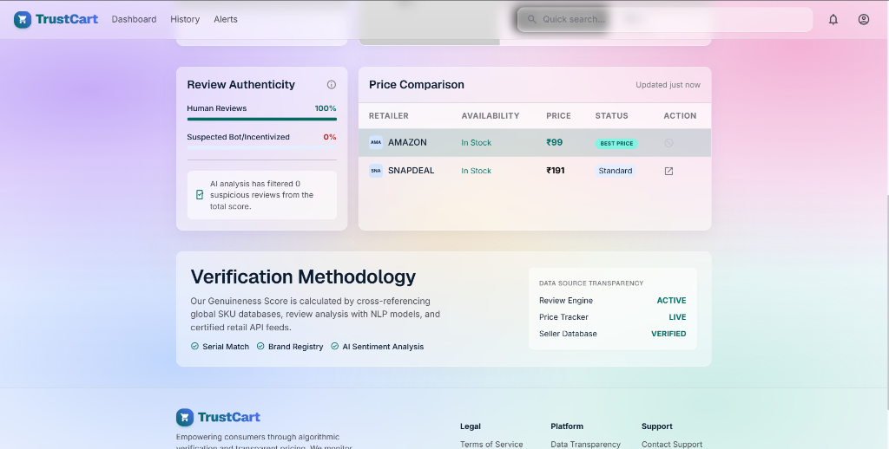
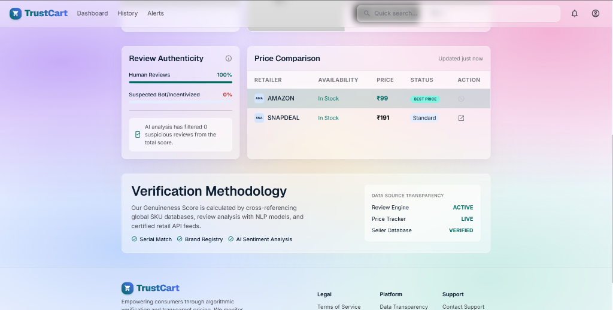
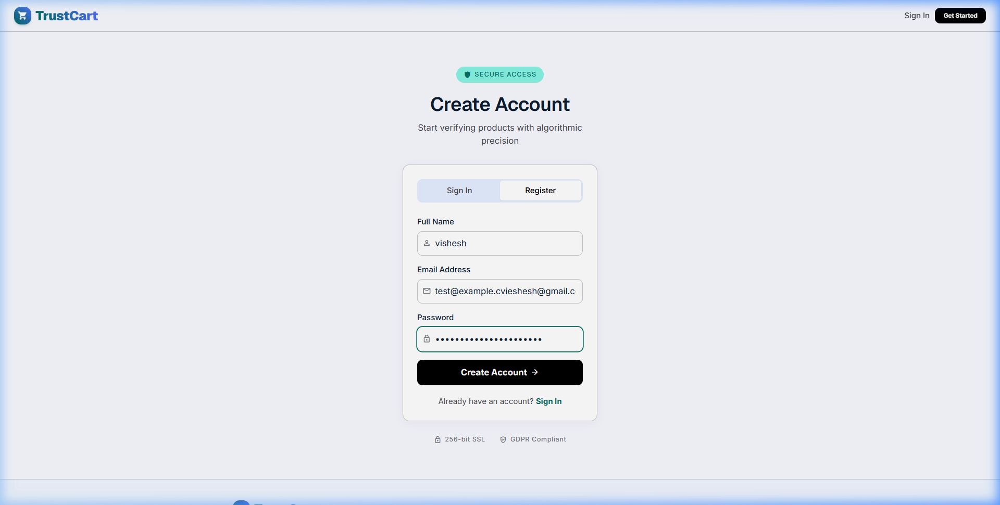
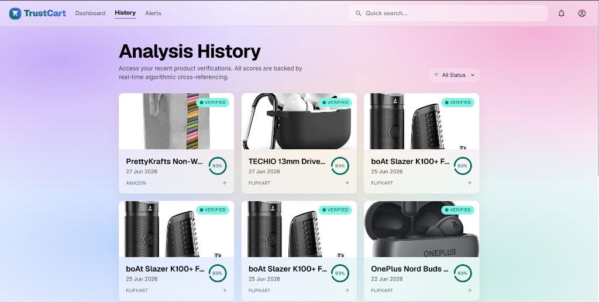

# TrustCart 🛡️
**AI-powered product authenticity & price intelligence for Indian e-commerce**

Paste any Amazon.in, Flipkart, Myntra, Meesho, Snapdeal, Nykaa, or Ajio product URL and get an instant AI-generated report on:
- ✅ Product authenticity score (0–100)
- 🔍 Fake review detection (8 heuristics)
- 🏪 Seller reputation scoring
- 💰 Real-time price comparison across platforms
- 🤖 Gemini Flash 2.0/2.2 synthesized verdict

---

## Screenshots

<p align="center">
  
  <br>
  <i>TrustCart Landing Page & Search Bar</i>
</p>

<p align="center">
  
  <br>
  <i>User Dashboard & Recent Audits</i>
</p>

<p align="center">
  
  <br>
  <i>Product Authenticity Scoring & AI Analysis</i>
</p>

<p align="center">
  
  <br>
  <i>Heuristic Review Metrics & Cross-Platform Price Tracking</i>
</p>

<p align="center">
  
  <br>
  <i>User Registration Interface</i>
</p>

<p align="center">
  
  <br>
  <i>Analysis History & Genuineness Gauge Records</i>
</p>

---

## Tech Stack

| Layer | Technology |
|-------|-----------|
| Frontend | React 18 + TypeScript + Vite + Tailwind CSS v3 |
| State | Zustand + React Query |
| Backend | Node.js + Express + TypeScript |
| AI Agent | LangChain.js + Google Gemini Flash 2.2 |
| Scraping | Playwright (headless Chromium) |
| Database | PostgreSQL 15 via Prisma ORM |
| Queue | BullMQ + Redis 7 |
| Auth | JWT + bcrypt |

---

## Prerequisites

- **Node.js** 18+ and npm
- **Google Gemini API key** — get one free at [aistudio.google.com](https://aistudio.google.com)

---

## Quick Start

### 1. Configure Backend
```bash
cd backend
cp .env.example .env
# Edit .env and add your GOOGLE_API_KEY
```

### 2. Install & Setup Backend
```bash
cd backend
npm install
npx prisma generate
npx prisma migrate dev      # applies migrations to Neon db
npx ts-node prisma/seed.ts   # optional: seed test data
```

### 3. Start Backend Server
```bash
cd backend
npm run dev
# API available at http://localhost:4000
# Swagger docs at http://localhost:4000/api/v1/docs
```

### 4. Start Analysis Worker (separate terminal)
```bash
cd backend
npm run worker:dev
```

### 5. Start Frontend
```bash
cd frontend
npm install
npm run dev
# App available at http://localhost:5173
```

---

## Environment Variables

### Backend (`backend/.env`)

| Variable | Description | Default |
|----------|-------------|---------|
| `PORT` | API server port | `4000` |
| `DATABASE_URL` | PostgreSQL connection string | see example |
| `REDIS_URL` | Redis connection string | `redis://localhost:6379` |
| `JWT_SECRET` | JWT signing secret (min 10 chars) | — |
| `GOOGLE_API_KEY` | **Your Gemini API key** | — |
| `AI_MODEL` | Gemini model name | `gemini-2.0-flash` |

### Frontend (`frontend/.env`)

| Variable | Description | Default |
|----------|-------------|---------|
| `VITE_API_URL` | Backend API base URL | `http://localhost:4000/api/v1` |

---

## API Endpoints

| Method | Path | Description |
|--------|------|-------------|
| `POST` | `/api/v1/auth/register` | Create account |
| `POST` | `/api/v1/auth/login` | Sign in |
| `GET` | `/api/v1/auth/me` | Get profile |
| `POST` | `/api/v1/analyses` | Submit product URL |
| `GET` | `/api/v1/analyses` | List analyses |
| `GET` | `/api/v1/analyses/:id` | Get full report |
| `GET` | `/api/v1/analyses/:id/status` | Poll job progress |
| `GET` | `/api/v1/analyses/:id/reviews` | Review breakdown |
| `GET` | `/api/v1/analyses/:id/prices` | Price comparisons |
| `POST` | `/api/v1/alerts` | Create price alert |
| `GET` | `/api/v1/alerts` | List alerts |
| `GET` | `/api/v1/health` | Health check |

Full Swagger docs: `http://localhost:4000/api/v1/docs`

---

## Project Structure

```
TrustKart/
├── backend/
│   ├── prisma/                 # Schema + migrations + seed
│   ├── src/
│   │   ├── agents/             # LangChain ReAct agent + tools
│   │   ├── config/             # DB, Redis, Queue, Env
│   │   ├── controllers/        # Request handlers
│   │   ├── middleware/         # Auth, validation, error, rate-limit
│   │   ├── routes/             # Express routes + Swagger docs
│   │   ├── services/           # AI, Scraper, Review, Price, Seller
│   │   ├── utils/              # Logger, platformDetector, scoreCalculator
│   │   └── workers/            # BullMQ analysis worker
│   └── package.json
└── frontend/
    ├── src/
    │   ├── api/                # Axios API clients
    │   ├── components/         # Reusable UI components
    │   ├── hooks/              # React Query + Zustand hooks
    │   ├── pages/              # Route pages
    │   ├── store/              # Zustand global state
    │   └── types/              # Shared TypeScript types
    └── package.json
```

---

## AI Agent Pipeline

```
URL Input
    ↓
[Tool 1] scrape_product_page   — Playwright scrapes product + reviews
    ↓
[Tool 2] analyze_reviews       — 8 heuristics detect fake reviews
    ↓
[Tool 3] check_seller          — Reputation scoring + flagged DB
    ↓
[Tool 4] fetch_price_comparisons — Cross-platform price search
    ↓
[Gemini Flash 2.2] Synthesizes verdict → JSON
    ↓
Score + Recommendation saved to PostgreSQL
```

> **Heuristic-only mode:** If no `GOOGLE_API_KEY` is set, the pipeline still runs all 4 tools but generates the verdict using deterministic scoring instead of AI.

---

## Running Tests

```bash
cd backend
npm test
```

---

## License

MIT
