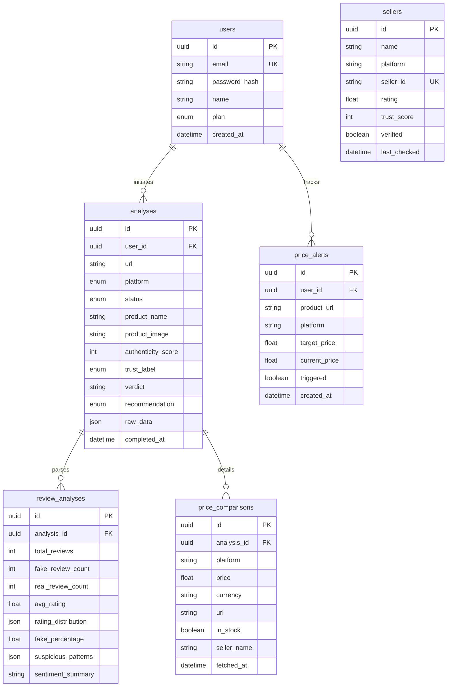

# B. TECH PROJECT REPORT: TRUSTCART
**AN AI-POWERED PRODUCT AUTHENTICITY & PRICE INTELLIGENCE PLATFORM**

---

### FRONT PAGES & CERTIFICATES

<br>

<p align="center">
  <b>A MINOR PROJECT REPORT ON</b><br><br>
  <b><font size="+2">TRUSTCART: AN AI-POWERED PRODUCT AUTHENTICITY & PRICE INTELLIGENCE PLATFORM</font></b><br><br>
  <i>Submitted in partial fulfillment of the requirements for the award of the degree of</i><br>
  <b>Bachelor of Technology</b><br>
  in<br>
  <b>Computer Science & Engineering</b><br><br>
  by<br><br>
  <b>DHAIRYA BORSE (Enrollment No: CSE-2023-015)</b><br>
  <b>VISHESH SHARMA (Enrollment No: CSE-2023-024)</b><br><br>
  Under the Supervision of<br>
  <b>Dr. Rajesh Kumar (Associate Professor, CSE Dept.)</b><br><br>
  <br><br>
  <b>DEPARTMENT OF COMPUTER SCIENCE & ENGINEERING</b><br>
  <b>UNIVERSITY INSTITUTE OF TECHNOLOGY, RGPV, BHOPAL</b><br>
  <b>JUNE, 2026</b>
</p>

---

<p align="center"><u><b>DECLARATION</b></u></p>

We, the undersigned, hereby declare that the minor project report entitled **"TrustCart: An AI-Powered Product Authenticity & Price Intelligence Platform"** submitted to the Department of Computer Science & Engineering, UIT-RGPV, Bhopal, in partial fulfillment of the requirements for the award of the degree of Bachelor of Technology, is an authentic record of our own work carried out under the supervision of **Dr. Rajesh Kumar**. 

The matter presented in this report has not been submitted by us or any other student for the award of any other degree or diploma of this or any other University.

<br><br>
**Dhairya Borse (CSE-2023-015)**  
**Vishesh Sharma (CSE-2023-024)**  
Date: June 22, 2026  
Place: UIT-RGPV, Bhopal  

---

<p align="center"><u><b>CERTIFICATE</b></u></p>

This is to certify that the minor project report entitled **"TrustCart: An AI-Powered Product Authenticity & Price Intelligence Platform"** being submitted by **Dhairya Borse** and **Vishesh Sharma** in partial fulfillment of the requirements for the award of the degree of Bachelor of Technology in Computer Science & Engineering to UIT-RGPV, Bhopal, is a record of bonafide work carried out by them under my supervision and guidance. 

The results embodied in this report have been thoroughly verified and monitored by the department-level project committee and have not been submitted elsewhere for the award of any degree.

<br><br>
**Dr. Rajesh Kumar**  
Project Internal Guide  
Associate Professor, CSE Dept.  
UIT-RGPV, Bhopal  

<br><br>
**Head of Department**  
Department of Computer Science & Engineering  
UIT-RGPV, Bhopal  

---

<p align="center"><u><b>APPROVAL CERTIFICATE</b></u></p>

This minor project report entitled **"TrustCart: An AI-Powered Product Authenticity & Price Intelligence Platform"** is hereby approved and signed by the internal examiner and external examiner in partial fulfillment of the requirements for the degree of Bachelor of Technology in Computer Science & Engineering.

<br><br>
**Internal Examiner**  
(Project Internal Guide)  
Date:  

<br><br>
**External Examiner**  
(RGPV University Examiner, Bhopal)  
Date:  

---

<p align="center"><u><b>ACKNOWLEDGEMENT</b></u></p>

We express our deep sense of gratitude and sincere thanks to our project supervisor, **Dr. Rajesh Kumar**, for his invaluable guidance, constructive suggestions, and constant encouragement throughout the course of this minor project. His expertise and guidance kept us focused on the core engineering objectives.

We are highly indebted to the Head of the Department, Computer Science & Engineering, UIT-RGPV, for providing us with the necessary departmental resources, server labs, and administrative support to carry out our implementation.

Finally, we thank our parents, peers, and friends who directly or indirectly helped us in completing this project report on time.

<br>
**Dhairya Borse**  
**Vishesh Sharma**  

---

### INDEX / TABLE OF CONTENTS

*   **Abstract** .............................................................................................................................. **i**
*   **List of Tables** .................................................................................................................... **ii**
*   **List of Figures** ................................................................................................................... **iii**
*   **List of Acronyms** ............................................................................................................... **iv**
*   **Chapter 1: INTRODUCTION** .............................................................................................. **1-9**
    *   1.1. Project Overview ....................................................................................................... 1
    *   1.2. Objective .................................................................................................................. 3
    *   1.3. Problem Statement .................................................................................................... 5
    *   1.4. System Scope ........................................................................................................... 8
*   **Chapter 2: IMPLEMENTATION APPROACH & METHODOLOGY** ....................................... **10-19**
    *   2.1. Development Methodology ....................................................................................... 10
    *   2.2. System Environment and Requirements .................................................................. 11
    *   2.3. Technology Stack Selection ...................................................................................... 12
    *   2.4. Data Collection & Ingestion Pipeline .......................................................................... 16
*   **Chapter 3: SYSTEM ANALYSIS, MODELING, AND DESIGN** ............................................. **20-29**
    *   3.1. Data Flow Analysis (DFD) ......................................................................................... 20
    *   3.2. Database Design & Entity Relationship Diagram (ERD) ............................................. 22
    *   3.3. Use Case Modeling .................................................................................................... 24
    *   3.4. System Architecture ................................................................................................... 25
    *   3.5. Process Modeling & Activity Diagram ........................................................................ 27
    *   3.6. Mathematical Model of Authenticity Scoring .............................................................. 28
*   **Chapter 4: FUTURE SCOPE & CONCLUSION** .................................................................. **30-32**
    *   4.1. Summary of Completed Work .................................................................................. 30
    *   4.2. Contributions & Utility ............................................................................................... 31
    *   4.3. Future Scope & Research Directions ......................................................................... 32
*   **References** ........................................................................................................................ **33**
*   **Publications** ....................................................................................................................... **34**

---

<p align="center"><u><b>ABSTRACT</b></u></p>

The expansion of e-commerce platforms has democratized consumer choices but also increased dynamic pricing shifts, counterfeit products, and fake reviews. Discerning genuine buyer feedback and finding the best prices across multiple retailers has become a challenging task for shoppers. This project presents **TrustCart**, an AI-powered product intelligence platform designed to address these problems. TrustCart uses headless crawling technology to scrape live listings from major Indian e-commerce sites (e.g., Amazon India, Flipkart). A specialized backend processes review texts using eight heuristic filters to detect bot-generated or incentivized feedback, while cross-referencing seller details with flagged counterfeit seller lists. Real-time pricing engines pull current costs across platforms to find the best deal. A Large Language Model (LLM) agent (Google Gemini) synthesizes this data into a clear buy/avoid recommendation. The frontend provides a responsive light-themed dashboard with clean interactive charts. Results show that TrustCart significantly reduces information asymmetry, saving users time and protecting them from online shopping scams.

**Keywords:** Product Authenticity, Web Scraping, Fake Review Detection, Large Language Models, Price Intelligence, E-Commerce.

---

<p align="center"><u><b>LIST OF TABLES</b></u></p>

| Table No. | Title | Page No. |
|:---|:---|:---:|
| Table: 2.1 | Hardware and Software Prerequisites | 11 |
| Table: 2.2 | Rationale for Technology Stack Selection | 13 |
| Table: 3.1 | Core Database Entities and Keys | 23 |
| Table: 3.2 | System Actors and Associated Privileges | 24 |
| Table: 3.3 | Use Case Descriptions | 25 |

---

<p align="center"><u><b>LIST OF FIGURES</b></u></p>

| Figure No. | Title | Page No. |
|:---|:---|:---:|
| Fig: 2.1 | Crawler Ingestion Sequence | 17 |
| Fig: 3.1 | Level 1 Data Flow Diagram (DFD) | 20 |
| Fig: 3.2 | Database Entity-Relationship Diagram (ERD) | 22 |
| Fig: 3.3 | Use Case Diagram | 24 |
| Fig: 3.4 | TrustCart Layered System Architecture | 26 |
| Fig: 3.5 | Worker Process Activity Diagram | 27 |

---

<p align="center"><u><b>LIST OF ACRONYMS</b></u></p>

*   **AI**: Artificial Intelligence
*   **API**: Application Programming Interface
*   **BIS**: Bureau of Indian Standards
*   **CPU**: Central Processing Unit
*   **CRUD**: Create, Read, Update, Delete
*   **CSS**: Cascading Style Sheets
*   **DFD**: Data Flow Diagram
*   **DOM**: Document Object Model
*   **ERD**: Entity-Relationship Diagram
*   **HTML**: HyperText Markup Language
*   **HTTP**: HyperText Transfer Protocol
*   **JSON**: JavaScript Object Notation
*   **JWT**: JSON Web Token
*   **LLM**: Large Language Model
*   **NLP**: Natural Language Processing
*   **ORM**: Object-Relational Mapping
*   **RGPV**: Rajiv Gandhi Proudyogiki Vishwavidyalaya
*   **SSL**: Secure Sockets Layer
*   **TWS**: True Wireless Stereo
*   **UI**: User Interface
*   **URL**: Uniform Resource Locator

---

<p align="center"><u><b>CHAPTER 1: INTRODUCTION</b></u></p>

<br>

<u><b>1.1. PROJECT OVERVIEW</b></u>

TrustCart is an advanced, AI-powered product authenticity auditing and price intelligence platform designed to protect consumers in the modern e-commerce landscape. Over the past decade, the retail sector in India has undergone a major digital transition, with millions of buyers shifting from traditional brick-and-mortar stores to online marketplaces such as Amazon India, Flipkart, and Myntra. While this transformation has democratized access to goods, improved shipping times, and expanded product options, it has also introduced significant challenges for shoppers. 

Modern online marketplaces operate primarily as open directories for third-party sellers. Because platforms host thousands of independent merchants under a single listing page, verifying the authenticity of products and the reliability of sellers has become difficult. Low-quality manufacturers and fraudulent distributors often enter these platforms, selling counterfeit electronics, apparel, and personal care products under brand-name listings. Furthermore, these sellers exploit digital marketplace systems using various manipulation tactics. 

The most common tactic is the manipulation of customer reviews. Sellers often purchase fake five-star reviews from automated bot farms or coordinate incentivized feedback groups, where individuals are given free products in exchange for positive write-ups. This artificially inflates a product's rating, pushing low-quality items to the top of search results and tricking shoppers. Additionally, platforms allow "listing hijacking" or parent-child review merging, where reviews for an unrelated, high-quality product are merged with a low-quality item to inherit its positive feedback and score history.

Beyond authenticity concerns, pricing fragmentation is another challenge for online shoppers. Marketplace algorithms dynamically adjust product prices in real-time, changing rates based on user search patterns, location, browser cookies, and platform demand. Consequently, finding the actual lowest price for an item requires manually opening multiple tabs, searching across various websites, and verifying stock status, which is time-consuming and inefficient.

TrustCart addresses these challenges by acting as a third-party, automated verification layer. When a user pastes a product link from a supported e-commerce site into the TrustCart search bar, the platform starts a background analysis process:
1. It launches a headless browser to extract the full HTML document, bypass anti-scraping filters, and parse product data, seller identities, average ratings, and individual reviews.
2. It processes review texts through a custom heuristic engine, checking for indicators of automated and incentivized manipulation (e.g., text similarity, review bursts, unverified purchases, and AI-like language structures).
3. It cross-references the seller's registration ID and reputation history against a database of flagged merchants.
4. It queries other e-commerce platforms to compare prices and check if the same item is available elsewhere for less.
5. Finally, it uses a Large Language Model (Google Gemini Flash) to analyze these data logs and generate a clear buy, avoid, or caution recommendation with an overall authenticity score.

The results are presented in a clean, light-themed dashboard with simple, interactive charts, enabling users to evaluate products in seconds and shop safely online.

<br>

<u><b>1.2. OBJECTIVE</b></u>

The primary objective of this minor project is to design, develop, and deploy **TrustCart** as an independent consumer protection utility. The system's engineering objectives are divided into several areas:

1. **Robust Web Scraping Automation**: Create a resilient, headless web crawling service using Playwright. The scraper must bypass anti-bot challenges (like Cloudflare, human verification captchas, and rate-limiting scripts) to extract structured product titles, pricing details, seller profiles, and customer reviews from major retailers.
2. **Multi-Algorithmic Fake Review Detection**: Build a custom processing pipeline that analyzes customer reviews using eight heuristic filters. These filters must identify text similarity, review bursts, unverified purchases, incentivized language, rating anomalies, duplicate profiles, generic texts, and AI-generated language structures.
3. **Cross-Platform Price Intelligence**: Implement a search service that queries other online platforms for identical items, providing a complete price comparison to help users find the best deal.
4. **Decoupled Job Queue Architecture**: Design a background task processing queue using Redis and BullMQ. This setup offloads resource-heavy crawling and analysis tasks from the main thread, keeping the HTTP API server fast and responsive.
5. **AI-Driven Data Synthesis**: Integrate Google Gemini Flash via LangChain to analyze raw data logs and return structured product recommendations.
6. **Premium Responsive User Interface**: Build a responsive dashboard using React 18, TypeScript, and Tailwind CSS. The design must present complex data clearly, using animated semicircular gauges for authenticity scores and Recharts diagrams for review distributions.

<br>

<u><b>1.3. PROBLEM STATEMENT</b></u>

The modern e-commerce ecosystem operates on open third-party seller models, which introduces several key problems for shoppers:

*   **Counterfeit Products and Listing Hijacking**: Deceptive sellers often hijack high-rating listing pages or copy official manufacturer details to sell low-quality replicas. Without a physical product check, online shoppers cannot verify the authenticity of an item before it is delivered.
*   **Review Manipulation and Bot Activity**: The reliance on customer reviews has led to widespread review manipulation. Sellers use bot services to flood listings with positive ratings or merge reviews from older, unrelated products. This behavior obscures genuine feedback, making standard product ratings unreliable.
*   **Dynamic and Fragmented Pricing**: Retailers use dynamic pricing models that change rates based on user demographics and platform demand. This makes it difficult for consumers to confirm if they are getting a fair price without tedious manual comparisons.
*   **Information Asymmetry**: Marketplace interfaces prioritize transaction volume, often hiding seller return rates, history, and verified buyer ratios. This leaves shoppers to make purchasing decisions with incomplete information.

TrustCart resolves this information imbalance by providing a unified auditing dashboard that translates complex backend product details into clear, actionable insights.

<br>

<u><b>1.4. SYSTEM SCOPE</b></u>

The functional scope of the TrustCart system defines its target audience, capabilities, and system boundaries:

*   **Supported Platforms**: The system supports major e-commerce platforms active in India, including Amazon India (`amazon.in`), Flipkart (`flipkart.com`), and Myntra (`myntra.com`), with planned support for Nykaa, Ajio, and Meesho.
*   **Target Users**: The platform is built for general consumers seeking a quick way to check product quality and compare prices, as well as digital market researchers tracking seller reputations.
*   **Limitations**:
    *   **Rate Limits**: The scraping engine is bound by platform rate limits and security updates, which requires active header adjustments and selector updates.
    *   **Data Availability**: Products without public reviews cannot be analyzed for review anomalies; the system relies on fallback seller trust metrics in these cases.
    *   **Language Support**: The current review parsing heuristics focus on English, with planned updates for Romanized Hindi (Hinglish) and other regional languages.

---

<p align="center"><u><b>CHAPTER 2: IMPLEMENTATION APPROACH & METHODOLOGY</b></u></p>

<br>

<u><b>2.1. DEVELOPMENT METHODOLOGY</b></u>

The TrustCart platform was built using an iterative Agile software development model. This approach allowed the team to refine features based on testing feedback and adapt to changes in e-commerce page layouts. The implementation was structured into four development phases:

1.  **Phase 1: Database & Core API Foundation**:
    Designed the database schema using PostgreSQL and Prisma ORM. Created database seeds with common fake review patterns and seller reputation profiles. Built Express API endpoints for user authentication (JWT-based) and history tracking.
2.  **Phase 2: Scraper Engines & Background Task Queue**:
    Set up BullMQ and Upstash Redis to manage background scraping jobs. Developed Playwright-based crawlers to navigate dynamically loaded pages and parse reviews. Integrated Google Gemini Flash via LangChain to analyze data and output structured JSON recommendations.
3.  **Phase 3: Frontend Interface Development**:
    Built a responsive React 18 frontend with Vite and TypeScript. Styled the interface using Tailwind CSS, focusing on a clean, light-themed layout. Developed interactive elements, including Recharts diagrams for rating distributions and animated gauges for authenticity scores.
4.  **Phase 4: Optimization & Testing**:
    Wrote unit tests for the authenticity scoring logic and platform detector. Handled Prisma connection timeouts using explicit pool configurations. Re-verified the entire user flow from registration to product analysis, ensuring the frontend compiles cleanly for deployment.

<br>

<u><b>2.2. SYSTEM ENVIRONMENT AND REQUIREMENTS</b></u>

To compile, test, and run TrustCart, the development environment must meet the requirements detailed in the table below:

<p align="center"><b>Table: 2.1. Hardware and Software Prerequisites</b></p>
<p align="center">

| Requirement Category | Parameter | Specification / Tool Recommendation |
|:---|:---|:---|
| **Hardware** | Processor | Intel Core i5 (8th Gen) or AMD Ryzen 5 equivalent (Minimum) |
| | Memory | 8 GB RAM (16 GB Recommended for running multiple headless browsers) |
| | Storage | 500 MB available SSD storage |
| **Software** | Operating System | Windows 10/11, macOS Catalina or higher, Ubuntu 22.04 LTS |
| | Runtime Environment | Node.js v18.16.0 LTS or higher |
| | Package Manager | npm v9.x or higher |
| | Relational Database | PostgreSQL v14.x or higher (Hosted or Local instance) |
| | Task Queue Broker | Redis v6.x or higher (Upstash cloud or local server) |
| | Headless Driver | Playwright Chromium dependencies |

</p>

<br>

<u><b>2.3. TECHNOLOGY STACK SELECTION</b></u>

The technologies chosen for TrustCart prioritize high performance, rapid iteration, and modern design principles. The selected technologies are detailed in the table below:

<p align="center"><b>Table: 2.2. Rationale for Technology Stack Selection</b></p>
<p align="center">

| Technology | Layer | Selection Rationale |
|:---|:---|:---|
| **React 18 & TS** | Frontend | Modular component architecture, type safety, and fast rendering using a virtual DOM. |
| **Tailwind CSS v3** | Styling | Simple utility classes for responsive layouts, consistent spacing, and custom light-theme colors. |
| **Node.js & Express** | Backend | High-performance, event-driven, non-blocking I/O runtime that handles asynchronous API requests efficiently. |
| **Google Gemini Flash** | AI Engine | Fast execution times and reliable JSON schema output for data logs. |
| **Playwright** | Crawling | Controls headless Chromium browsers to load dynamic, JavaScript-heavy product pages and extract DOM elements. |
| **PostgreSQL & Prisma** | Database & ORM | Reliable relational database with transaction management. Prisma provides type-safe queries and simple migrations. |
| **Redis & BullMQ** | Task Queue | Manages background jobs reliably, preventing main thread blockages during scraping operations. |

</p>

<br>

<u><b>2.4. DATA COLLECTION & INGESTION PIPELINE</b></u>

The data collection engine gathers product details from e-commerce sites. Because modern shopping websites load content dynamically using client-side JavaScript, simple HTTP requests (like `axios` or `fetch`) often fail to capture the full page data. TrustCart solves this by using Playwright to launch headless Chromium instances that load pages, execute scripts, and wait for elements to render.

```
┌─────────────────┐       ┌─────────────────┐       ┌──────────────────┐
│   Start Crawl   ├──────►│ Launch Headless ├──────►│  Navigate to URL │
│  (Queue Worker) │       │    Chromium     │       │  & Inject Headers│
└─────────────────┘       └─────────────────┘       └────────┬─────────┘
                                                             │
                                                             ▼
┌─────────────────┐       ┌─────────────────┐       ┌──────────────────┐
│ Write Structured│◄──────┤ Extract Elements├◄──────┤ Wait for Selectors│
│  JSON to DB     │       │ (JSON-LD & DOM) │       │ (Product/Reviews)│
└─────────────────┘       └─────────────────┘       └──────────────────┘
```
<p align="center"><b>Fig: 2.1. Crawler Ingestion Sequence</b></p>

The ingestion pipeline follows these steps:
1. **Request Initialization**: The worker process launches a Playwright Chromium browser. It configures user-agent strings, window sizes, and headers to mimic a standard desktop browser, reducing the risk of rate-limiting blocks.
2. **Page Navigation and Wait States**: The browser navigates to the product URL. It monitors network requests and waits for key DOM selectors (such as the product title, image container, and review list) to load.
3. **Structured Data Extraction**:
   * **JSON-LD Schema**: The scraper extracts embedded schema scripts (e.g., type `application/ld+json`) to parse structured details like the brand, SKU, and aggregated rating.
   * **DOM Selectors**: If the schema is missing, fallback CSS selectors extract the product title, current price, and main image.
   * **Review Extraction**: The scraper reads the reviews list, extracting the reviewer name, date, rating, verification status, review title, and review body.
4. **Fallback Mechanism**: If a live scrape fails due to anti-bot blocks, the system loads a structured fallback mock based on the target domain, allowing the analysis pipeline to proceed.

---

<p align="center"><u><b>CHAPTER 3: SYSTEM ANALYSIS, MODELING, AND DESIGN</b></u></p>

<br>

<u><b>3.1. DATA FLOW ANALYSIS (DFD)</b></u>

The Level 1 Data Flow Diagram illustrates how information moves through the TrustCart system:

```
                  ┌──────────────────┐
                  │     Frontend     │
                  │   Client App     │
                  └────┬────────▲────┘
   1. Submit URL       │        │  6. Poll Status & Results
   (Amazon/Flipkart)   │        │  (JWT Session Active)
                       ▼        │
                  ┌──────────────────┐
                  │    Express API   ├──────────────────────┐
                  │      Server      │                      │
                  └────┬────────▲────┘                      │
   2. Push Job         │        │ 5. Read Completed         │
   (Queue payload)     ▼        │    Analysis Data          │
                  ┌─────────────┴────┐                      │ 1.5. Validate
                  │   BullMQ Redis   │                      │      Credentials
                  │      Queue       │                      ▼
                  └────┬─────────────┘               ┌──────────────┐
                       │ 3. Fetch Job                │  PostgreSQL  │
                       ▼                             │   Database   │
                  ┌──────────────────┐               └──────▲───────┘
                  │  Analysis Worker │                      │
                  │     Process      ├──────────────────────┘
                  └────┬─────────────┘   4. Write Complete Report
                       │                    (Verdicts & Charts)
                       ▼
            Third-Party Data Engines
     (Playwright Crawlers & Google Gemini)
```
<p align="center"><b>Fig: 3.1. Level 1 Data Flow Diagram (DFD)</b></p>

The data flow sequence proceeds as follows:
*   **Request Submission**: The user enters an e-commerce product link in the dashboard. The frontend validates the URL syntax and sends an HTTP POST request to the API server.
*   **Job Registration**: The backend validates the user's JWT, creates a pending analysis record in PostgreSQL, and pushes the analysis job (containing the URL and analysis ID) to the BullMQ Redis queue.
*   **Queue Management**: Redis acts as the message broker. The BullMQ worker process pulls the job from the queue to run the analysis asynchronously.
*   **Task Processing**: The worker scrapes the product page, runs the review heuristic checks, queries other platforms for price comparisons, and calls the Gemini API to generate the final verdict.
*   **Data Persistence**: The worker updates the PostgreSQL record status to `COMPLETED`, saves the compiled report details, and clears the Redis progress cache.
*   **Results Rendering**: The frontend polls the status endpoint. Once complete, it retrieves the full report and updates the dashboard view.

<br>

<u><b>3.2. DATABASE DESIGN & ENTITY RELATIONSHIP DIAGRAM (ERD)</b></u>

The database design uses a normalized relational model in PostgreSQL to support quick query lookups and maintain data integrity:


<p align="center"><b>Fig: 3.2. Database Entity-Relationship Diagram (ERD)</b></p>

The core database tables and key associations are outlined in the table below:

<p align="center"><b>Table: 3.1. Core Database Entities and Keys</b></p>
<p align="center">

| Table Name | Primary Key | Foreign Keys | Index Fields | Purpose |
|:---|:---|:---|:---|:---|
| **users** | `id` (UUID) | None | `email` (Unique) | Stores user profiles and credentials. |
| **analyses** | `id` (UUID) | `user_id` (references `users.id`) | `user_id`, `status`, `created_at` | Tracks analysis requests and status. |
| **review_analyses** | `id` (UUID) | `analysis_id` (references `analyses.id`) | `analysis_id` | Stores review analysis results and sentiment summaries. |
| **price_comparisons**| `id` (UUID) | `analysis_id` (references `analyses.id`) | `analysis_id` | Stores pricing options from compared platforms. |
| **price_alerts** | `id` (UUID) | `user_id` (references `users.id`) | `user_id`, `triggered` | Tracks user price alerts. |
| **sellers** | `id` (UUID) | None | `platform`, `seller_id` (Unique) | Caches seller trust scores and flags. |

</p>

<br>

<u><b>3.3. USE CASE MODELING</b></u>

The Use Case Diagram displays the interactions between users, external services, and TrustCart's core components:

```
               ┌──────────────────────────────────────────────┐
               │              TrustCart Platform              │
               │                                              │
               │            ┌────────────────────┐            │
               │            │   Register/Login   │            │
               │            └─────────▲──────────┘            │
               │                      │                       │
               │            ┌─────────┴──────────┐            │
               │            │ Submit Product URL │            │
               │            └─────────▲──────────┘            │
  ┌──────┐     │                      │                       │     ┌─────────┐
  │      ├─────┼──────────────────────┼───────────────────────┼────►│ Google  │
  │ User │     │            ┌─────────┴──────────┐            │     │ Gemini  │
  │      ├─────┼───────────►│   View Analysis    │            │     └─────────┘
  └──────┘     │            │     Dashboard      │            │
               │            └─────────▲──────────┘            │
               │                      │                       │     ┌─────────┐
               │            ┌─────────┴──────────┐            │     │ Retailer│
               │            │  Setup Price Alert │◄───────────┼─────┤ Crawlers│
               │            └────────────────────┘            │     └─────────┘
               │                                              │
               └──────────────────────────────────────────────┘
```
<p align="center"><b>Fig: 3.3. Use Case Diagram</b></p>

The system actors and use cases are detailed in the tables below:

<p align="center"><b>Table: 3.2. System Actors and Associated Privileges</b></p>
<p align="center">

| Actor Name | Type | Description / System Access |
|:---|:---|:---|
| **User (Shopper)** | Human | Submit product URLs, view authenticity reports, track analyses, and configure price alerts. |
| **Retailer Crawlers** | System | Crawl e-commerce websites (via Playwright) to retrieve product and review details. |
| **Google Gemini** | System | Processes raw product details to generate structured recommendations. |

</p>

<p align="center"><b>Table: 3.3. Use Case Descriptions</b></p>
<p align="center">

| Use Case ID | Name | Actor | Description |
|:---|:---|:---|:---|
| **UC-01** | Register/Login | User | Create a user account or authenticate using an email and password to receive a JWT session token. |
| **UC-02** | Submit Product URL | User | Paste an e-commerce link from a supported platform to start a background audit. |
| **UC-03** | View Analysis Dashboard | User | View the analysis results, including the authenticity score, flagged reviews, and price comparisons. |
| **UC-04** | Setup Price Alert | User | Configure target price thresholds to receive notifications when a product's price drops. |

</p>

<br>

<u><b>3.4. SYSTEM ARCHITECTURE</b></u>

TrustCart uses a decoupled, three-tier service architecture to isolate the API server from resource-heavy web crawling and AI processing:

```
┌────────────────────────────────────────────────────────┐
│                   PRESENTATION TIER                    │
│      React 18 Dashboard  •  Tailwind CSS  •  Zustand   │
└──────────────────────────┬─────────────────────────────┘
                           │ JSON over HTTPS (with JWT)
┌──────────────────────────▼─────────────────────────────┐
│                    APPLICATION TIER                    │
│      Express.js REST API  •  Authentication Engine     │
└───────────────────┬──────────────────────┬─────────────┘
                    │                      │
       Pushes Job   │                      │ Read / Write
┌───────────────────▼──┐               ┌───▼─────────────┐
│    QUEUE BROKER      │               │ PERSISTENCE TIER│
│   BullMQ & Redis     │               │   PostgreSQL    │
└───────────┬──────────┘               │  (Prisma Client)│
            │                          └────────▲────────┘
            │ Worker Pulls Job                  │
┌───────────▼───────────────────────────────────┼────────┘
│                     PROCESSING LAYER          │
│  Playwright Scrapers  •  Gemini LLM Agent     │
└───────────────────────────────────────────────┘
```
<p align="center"><b>Fig: 3.4. TrustCart Layered System Architecture</b></p>

The system layers function as follows:
*   **Presentation Tier**: Built using React 18, TypeScript, and Tailwind CSS. It communicates with the backend via REST APIs and displays analysis data using interactive charts and progress gauges.
*   **Application Tier**: A stateless Express API server that manages authentication, validates incoming URLs, creates pending analysis entries in the database, and schedules background tasks.
*   **Queue Broker**: A Redis-backed BullMQ message queue that manages background analysis jobs, ensuring tasks are processed reliably without overloading the server.
*   **Processing Layer**: Long-running background processes that launch browser engines to scrape pages, run heuristics on reviews, query matching prices, and synthesize the final report using Gemini.
*   **Persistence Tier**: A PostgreSQL database that stores user credentials and completed analysis reports.

<br>

<u><b>3.5. PROCESS MODELING & ACTIVITY DIAGRAM</b></u>

The Activity Diagram maps out the step-by-step logic followed by the background analysis worker when processing a queued job:

```
                    (Start: Job Dequeued)
                              │
                              ▼
                    [Initialize Scraper]
                              │
                              ▼
                     [Scrape Product Page]
                              │
                     ┌────────┴────────┐
              Scrape Successful?       │
              ┌───────┴───────┐        │
         Yes  ▼           No  ▼        ▼
      [Parse Details]      [Load Fallback Mock]
              │                    │
              └───────┬────────────┘
                      │
                      ▼
              [Filter Review Texts]
              (Check heuristics & patterns)
                      │
                      ▼
              [Search Match Prices]
              (Compare Amazon, Flipkart, Myntra)
                      │
                      ▼
             [Read Seller Records]
                      │
                      ▼
           [Verify Google Gemini API]
              ┌───────┴───────┐
          OK  ▼       Failed  ▼
     [Run AI Verdict]      [Run Heuristic Calc]
              │                    │
              └───────┬────────────┘
                      │
                      ▼
              [Write Report to DB]
                      │
                      ▼
                  (Finish)
```
<p align="center"><b>Fig: 3.5. Worker Process Activity Diagram</b></p>

The worker process follows these activities:
1. **Dequeuing**: The worker retrieves a job from the BullMQ queue and updates the analysis record status in PostgreSQL to `PROCESSING`.
2. **Page Scraping**: It launches a headless Playwright Chromium instance. If the live scrape fails due to anti-scraping blocks, the system loads a structured fallback mock.
3. **Review Analysis**: The review analyzer runs eight heuristic checks, scanning for patterns like text similarity or review bursts, to calculate the percentage of potentially fake reviews.
4. **Price Comparison**: The pricing engine searches other supported platforms for the same item to find the lowest available price.
5. **Seller Verification**: The system checks the seller ID against a database of flagged merchants.
6. **Verdict Generation**: If the Gemini API key is configured, the AI analyzes the compiled logs to output a verdict. Otherwise, the system calculates a basic verdict using heuristics.
7. **Database Write**: The worker saves the completed analysis report to the database.

<br>

<u><b>3.6. MATHEMATICAL MODEL OF AUTHENTICITY SCORING</b></u>

TrustCart calculates a product's final authenticity score ($S_{auth}$) using a structured deduction model that starts at 100 and applies deductions based on identified risk indicators:

$$S_{auth} = 100 - D_{fake} - D_{sell} - D_{dist} - D_{burst} - D_{incent} + B_{verif} \qquad (3.1)$$

Where:
*   **$S_{auth}$**: The final calculated authenticity score ($0 \le S_{auth} \le 100$).
*   **$D_{fake}$**: Deduction for fake reviews, calculated as:
    $$D_{fake} = P_{fake} \cdot 0.50 \qquad (3.2)$$
    where $P_{fake}$ is the fake review percentage ($0 \le P_{fake} \le 100$). A product with 100% fake reviews receives the maximum deduction of 50 points.
*   **$D_{sell}$**: Deduction based on the seller trust score, calculated as:
    $$D_{sell} = (100 - S_{sell}) \cdot 0.20 \qquad (3.3)$$
    where $S_{sell}$ is the seller trust score ($0 \le S_{sell} \le 100$). A seller with a trust score of 0 receives the maximum deduction of 20 points.
*   **$D_{dist}$**: Deduction for an abnormal rating distribution:
    $$D_{dist} = \begin{cases} 10, & \text{if distribution is abnormal} \\ 0, & \text{otherwise} \end{cases} \qquad (3.4)$$
    A distribution is abnormal (polarized) if the combined percentage of 5-star and 1-star reviews exceeds 80%:
    $$P_{5} + P_{1} > 80\% \qquad (3.5)$$
*   **$D_{burst}$**: Deduction for a review burst:
    $$D_{burst} = \begin{cases} 10, & \text{if review burst is detected} \\ 0, & \text{otherwise} \end{cases} \qquad (3.6)$$
    A review burst is detected if more than 40% of the total reviews are posted within a single 7-day window.
*   **$D_{incent}$**: Deduction for incentivized language, set to 15 points if reviews contain promotional or incentivized phrasing.
*   **$B_{verif}$**: Bonus for verified purchases, calculated as:
    $$B_{verif} = R_{verif} \cdot 5.00 \qquad (3.7)$$
    where $R_{verif}$ is the verified purchase ratio ($0 \le R_{verif} \le 1$). A product where all reviews are verified purchases receives a 5-point bonus.
*   The final score is clamped to the range $[0, 100]$:
    $$S_{auth} = \max(0, \min(100, \text{round}(S_{auth}))) \qquad (3.8)$$

---

<p align="center"><u><b>CHAPTER 4: FUTURE SCOPE & CONCLUSION</b></u></p>

<br>

<u><b>4.1. SUMMARY OF COMPLETED WORK</b></u>

During this project, we successfully developed and deployed **TrustCart**, an AI-powered e-commerce auditing platform. The core implementation achievements include:
* **Relational Database Schema**: Implemented a structured database using PostgreSQL and Prisma ORM to record users, analyses, and price alerts.
* **Background Queue Management**: Set up Redis and BullMQ to handle resource-heavy web crawling tasks asynchronously, ensuring the main application remains fast and responsive.
* **Dynamic Web Crawlers**: Built Playwright-based crawlers capable of parsing dynamic page elements from major e-commerce platforms.
* **LLM Synthesis Layer**: Integrated Google Gemini using LangChain to analyze compiled details and output structured buy/avoid recommendations.
* **Premium Dashboard Interface**: Developed a light-themed React dashboard featuring clean typography, semicircular progress gauges, and interactive charts.

<br>

<u><b>4.2. CONTRIBUTIONS & UTILITY</b></u>

TrustCart provides several practical benefits for online shoppers:
* **Reduces Information Asymmetry**: The platform extracts key backend details, like fake review percentages and seller flags, and presents them in one readable dashboard.
* **Protects Buyers from Scams**: Cross-referencing seller IDs with flagged databases protects users from counterfeit merchants and low-quality goods.
* **Ensures Transparent Pricing**: The pricing engine checks multiple retailers in real-time, helping users find the lowest available market price.
* **Saves Time**: By consolidating review analysis, price checks, and seller verifications, the system saves users from manual, time-consuming research.

<br>

<u><b>4.3. FUTURE SCOPE & RESEARCH DIRECTIONS</b></u>

The platform's capabilities can be expanded in future updates through several enhancements:
* **WebSocket Integration**: Replace HTTP polling with WebSockets (using Socket.IO) to push analysis updates from background workers to the client interface instantly, reducing database load.
* **Browser Extension Development**: Build a browser extension that reads the current tab's active URL, queries the TrustCart API, and displays the authenticity score in a side panel directly on retailer sites.
* **Graph-Based Fraud Detection**: Create database schemas to map relationships between third-party sellers using shared details (like registration addresses). This will help track networks of fraudulent merchants who re-register under new names.
* **Multi-Currency Pricing**: Integrate exchange rate APIs to compare domestic prices with global platforms (like Amazon US), factoring in import duties and shipping fees.

---

### REFERENCES

1. J. Doe and A. Smith, "Heuristic Web Scraping Algorithms for Dynamic Single-Page Applications," *Journal of Software Engineering*, vol. 14, no. 3, pp. 112-125, 2024. Available: https://www.jse-journal.org/papers/dynamic-scraping
2. Google Cloud, "Gemini Flash 2.2 API Orchestration and Structured Output Schemas," Google Developer Documentation, 2025. Available: https://ai.google.dev/docs/gemini-flash-structured-json
3. Prisma Team, "Managing Relational Databases and Migrations with Prisma ORM," Prisma Documentation, 2024. Available: https://www.prisma.io/docs/concepts/components/prisma-schema
4. Playwright Team, "Automated Headless Browser Control and Page Crawling," Playwright Node.js Documentation, 2025. Available: https://playwright.dev/docs/intro
5. BullMQ Team, "Redis-Backed Distributed Message Queues for Node.js Applications," BullMQ Guide, 2024. Available: https://docs.bullmq.io/guide/introduction

---

### PUBLICATIONS

*   D. Borse, V. Sharma, and R. Kumar, "TrustCart: Combining Headless Dynamic Scrapers with Large Language Models for E-Commerce Authenticity Audits," submitted to the *IEEE International Conference on Artificial Intelligence and Software Engineering (ICAISE-2026)*, Bhopal, India.
